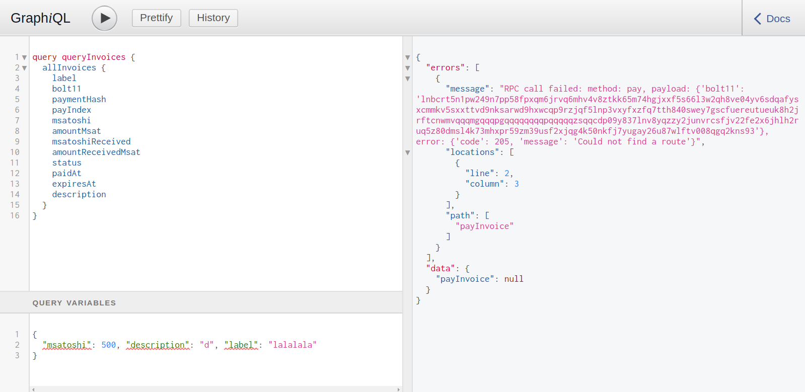
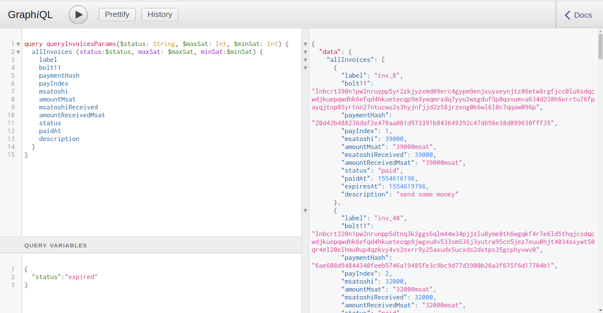
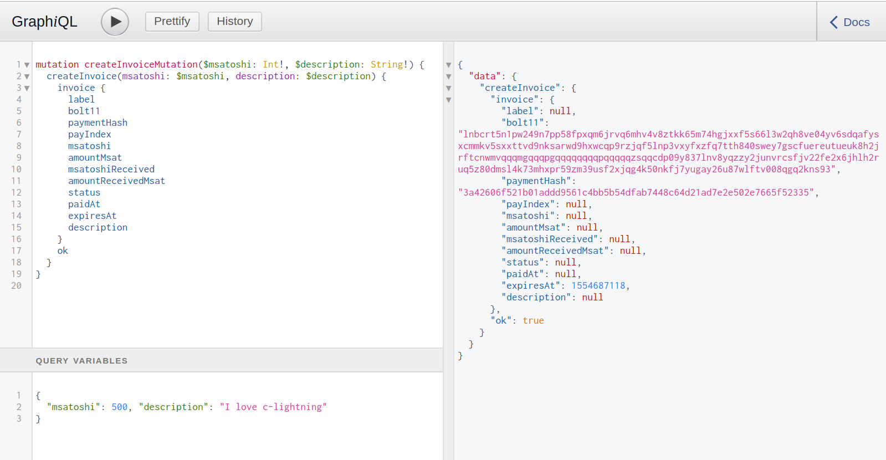
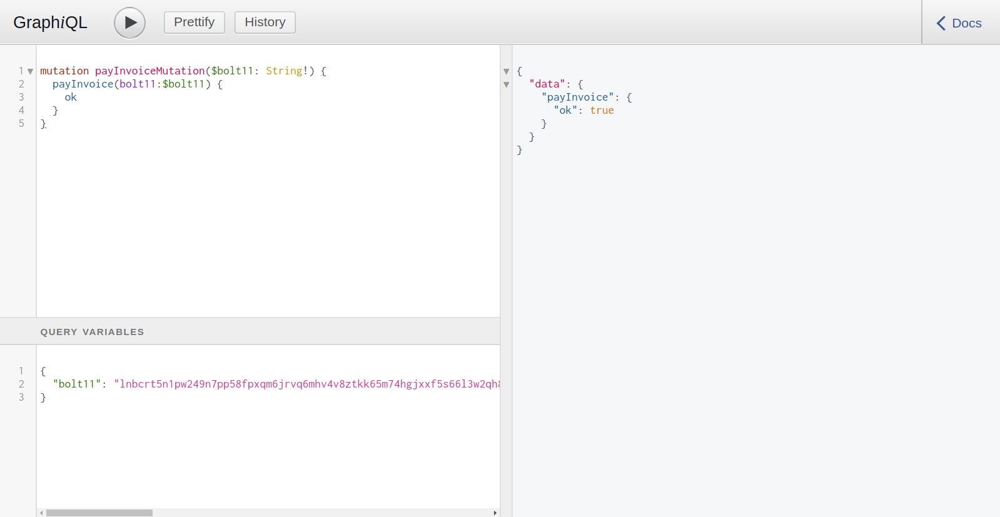

# Lightning-GraphQL

The goal of this project is to create a GraphQL endpoint that can create invoice, query, and pay Lightning invoices. It is implemented as a c-lightning plugin.

# Development Setup

### Installations

The essentials:

- Install bitcoind
- Install c-lightning
- Install lnet
- Create a virtual environment and install requirements:
```

Some helpers to fill your dev environment will some nodes, channels, and invoices:

- Have lnet make some connections: `./launch.sh 10 2`
- Install lnet-random
- Have lnet-random make some invoices: `node activity.js`
python3 -m venv venv
source venv/bin/activate
pip install -r requirements.txt
```

### Running Examples

To run a graphiql playground server to query your node. The parameter here is the path to your c-lightning RPC socket.

```
python app.py /path/to/your/lightning-rpc
```

Visit [http://127.0.0.1:5000/graphql](http://127.0.0.1:5000/graphql) in your prowser to play around with this GUI!

##### List invoices



```
query queryInvoices {
  allInvoices {
    label
    bolt11
    paymentHash
    payIndex
    msatoshi
    amountMsat
    msatoshiReceived
    amountReceivedMsat
    status
    paidAt
    expiresAt
    description
  }
}
```

##### List invoices w/ parameters

Parameters are defined in the "Query Parameters" in the bottom-left window in screenshot below.



```
query queryInvoicesParams($status: String) {
  allInvoices (status:$status) {
    label
    bolt11
    paymentHash
    payIndex
    msatoshi
    amountMsat
    msatoshiReceived
    amountReceivedMsat
    status
    paidAt
    description
  }
}
```

##### Create Invoice




```
mutation createInvoiceMutation($msatoshi: Int!, $description: String!) {
  createInvoice(msatoshi: $msatoshi, description: $description) {
    invoice {
      label
      bolt11
      paymentHash
      payIndex
      msatoshi
      amountMsat
      msatoshiReceived
      amountReceivedMsat
      status
      paidAt
      expiresAt
      description
    }
    ok
  }
}
```

##### Pay Invoice



```
mutation payInvoiceMutation($bolt11: String!) {
  payInvoice(bolt11:$bolt11) {
    ok
  }
}
```
